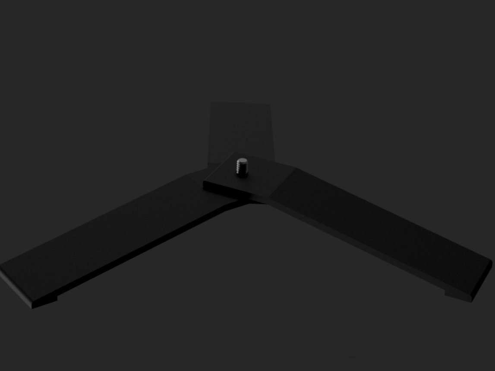
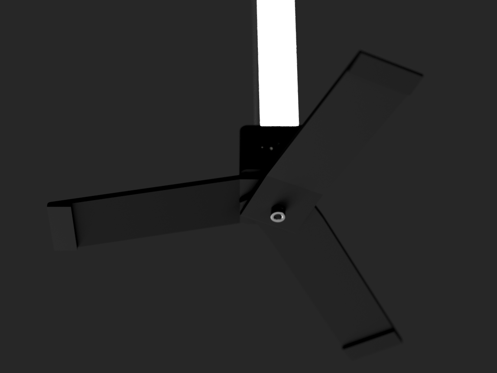
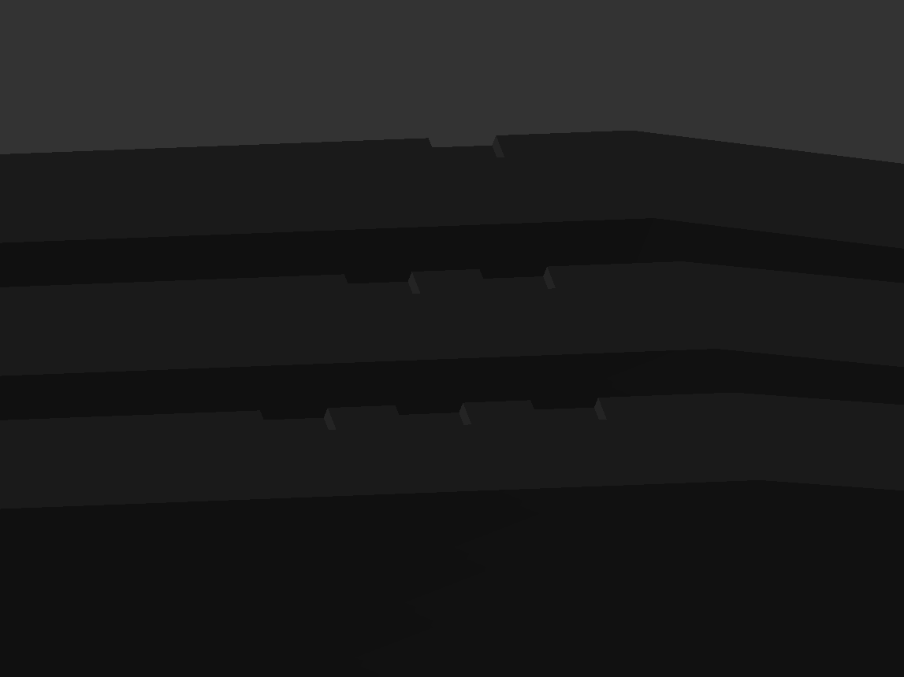

# Accessories list :

Here you will find the list of accessories for the bar. If you want to contribute, send me your design and I will add it ! 

- Tripod stand

 
 
 
 

## Tripod stand

    
    
    

The Tripod stand is mountable on each side of the bar using the 1/4 camera mount thread insert. It is composed of three differents printables parts and one [1/4" 20mm long screw](https://s.click.aliexpress.com/e/_c4dx4y9t)

You should see on last picture that there is little notch indicating the correct order from top to bottom

You can find the 3MF here :

  - [Top piece](https://github.com/mhlsf/Raptor-led/blob/main/stl/accessories/foot%20stand/Top%20foot%20stand.3mf)
  - [Middle piece](https://github.com/mhlsf/Raptor-led/blob/main/stl/accessories/foot%20stand/Middle%20foot%20stand.3mf)
  - [Bottom piece](https://github.com/mhlsf/Raptor-led/blob/main/stl/accessories/foot%20stand/Bottom%20foot%20stand.3mf)

