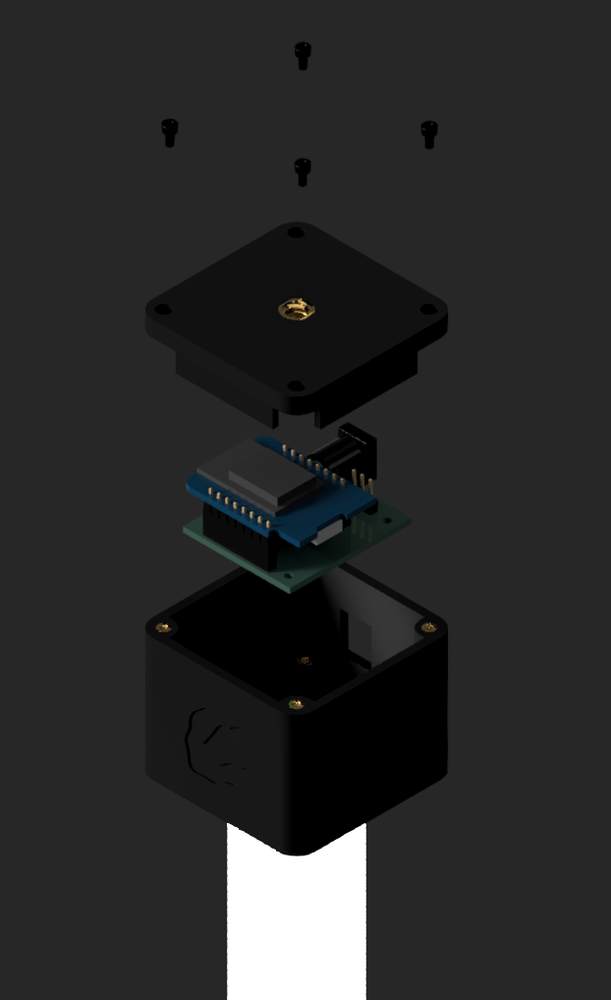
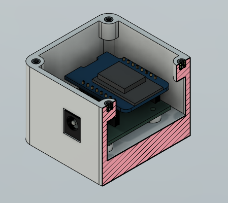
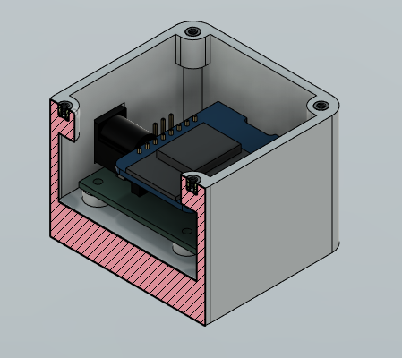
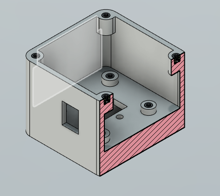
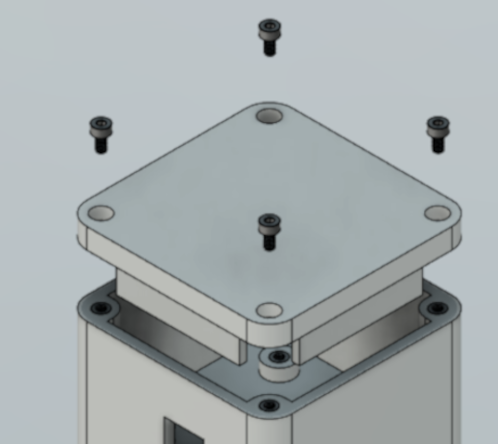

 

# Welcome to the project of open source pixel bar !

The project goal is to create an Astera like Pixel bar, that is easy to build and cheap !

__Depending on where you source the component, 1 bar should cost you less than 20€__

It work around Wemos D1 ESP8266 and feature a custom shield and enclosure to plug on a aluminium profile. We are using [Wled library](https://github.com/wled/WLED) to run the project !

You can find here a step by step tutorial on how to build one : [Build Tutorial](https://github.com/mhlsf/Raptor-led/blob/main/Tutorial.md)

There is also [accessories](https://github.com/mhlsf/Raptor-led/blob/main/Accessories.md) for mounting the bar on different support, for now I only have a tripod to make it stand on the ground. 

## List of components

- Wemos D1 microcontroller [Aliexpress](https://s.click.aliexpress.com/e/_c4cnO3hB)
- 8 x 3D printing insert M2, 3.3mm X 3mm [Aliexpress](https://s.click.aliexpress.com/e/_c2wnPTrL)
- 8 x M2 4mm long Screw [Aliexpress](https://s.click.aliexpress.com/e/_c3h62yXP)
- WS2812B eco led strip 1M, 60 leds IP65
- Led Aluminium profile (See section below)
- Custom Shield (See section below)
- 3D print box (See section below)

**Total Weight < 500g**

## Led Aluminium profile

The led aluminiun profile should have the following shape and be 1 meter long :

 

__It can be found on internet, but if you send me message I may get them for you cheaper as I order in bulk !__

## Custom shield for Wemos D1

 
 
 

The shield consist of a simple PCB that route power from the a Barrel jack input to the Wemos D1 and to the led strip with a jst connector.

The shield can be ordered online (JLCPCB for example), you then need to solder :

- Barrel Type DC Connector  [Aliexpress](https://s.click.aliexpress.com/e/_c32rjzPT)
- 2.54mm pin connector [Aliexpress](https://s.click.aliexpress.com/e/_c4cRkKOH)
- Female 8 Pin Header Socket

The 4 mounting Hole H1-H4 are for mounting to the 3D Print case

The kicad project with PCB layout and schematic is available as a zip named [Wemos D1 shield.zip](https://github.com/mhlsf/Raptor-led/blob/main/Wemos%20d1%20shield.zip)

__If needed, contact me, I can send you the ready to plug PCB for a small price !__

## 3D print box

The box can be printed using any recent 3D printer. It features holes for M3 inserts to screw the PCB and the lid. STEP files are available here.

There is three stl, one for the box for PCB, one for the lid of the box and one for the other end of the led bar.

8 holes for M3 insert are made for fixing the PCB board and the lid.

At the bottom of the PCB box, there is a hole for passing led cable and to fix the box to the bar using a small screw.

 
 
 
 
 

## Power 

Connect any 5V power source to the input jack and you are good to go. Each bar consumme around 15W with full brigthness white

#### Portable :

Most of the time I use [this cable](https://s.click.aliexpress.com/e/_c3CcIMGn) (you need the 5.5mm x 2.1mm version) and plug them directly to a portable battery.

On one 10 0000mah portable battery, I can run two bar for around 6 hours at max brightness (depends on the effect used).

#### Fixed :

You can also buy a power supply to run multiple bar on one power supply. I recommand the MeanWell brand for this. 

Be carefull of the wire gauge and the wiring

## Control

The leds can be controlled through Art-net with software like Resolume, QLC and other lighthing software.

You can also control them using the WLED app, you can check on their website more information about this

Many effect are programmed on those and thus easier to setup than a dedicated software

## What's next ?

My goal is to keep improving on this design, here some of my next iteration : 

- Included Battery
- Accepting range of 5v to 32V for daisy-chaining bars and long distance
- Water resistance
- 3D printed Tools to attach them to various support
- Make video tutorial ?

  

## Licence

Shield: [![CC BY-NC-SA 4.0][cc-by-nc-sa-shield]][cc-by-nc-sa]

This work is licensed under a
[Creative Commons Attribution-NonCommercial-ShareAlike 4.0 International License][cc-by-nc-sa].

[![CC BY-NC-SA 4.0][cc-by-nc-sa-image]][cc-by-nc-sa]

[cc-by-nc-sa]: http://creativecommons.org/licenses/by-nc-sa/4.0/
[cc-by-nc-sa-image]: https://licensebuttons.net/l/by-nc-sa/4.0/88x31.png
[cc-by-nc-sa-shield]: https://img.shields.io/badge/License-CC%20BY--NC--SA%204.0-lightgrey.svg
