# Step by step Guide to build one bar

Depending on the kit you have, you may require the following tool : 

## List of tools
- Solder Iron
- Screwdriver for Allen M2
- Screwdriver for small Cross

## List of components

- Wemos D1 microcontroller [Aliexpress](https://s.click.aliexpress.com/e/_c4cnO3hB)
- 8 x 3D printing insert M3, 3.5mm X 3.5mm [Aliexpress](https://s.click.aliexpress.com/e/_c2wnPTrL)
- 8 x M2 4mm long Screw [Aliexpress](https://s.click.aliexpress.com/e/_c3h62yXP)
- WS2812B eco led strip 1M, 60 leds IP65
- Led Aluminium profile
- Custom Shield
- 3D printed box

  

# Step 1

 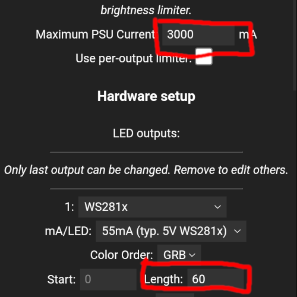

Install wled on the Wemos using this page : https://install.wled.me/ (only work on chrome)

Connect to the router you are going to use for synchronising your led

And then on the setting set the current to 3000ma and the length to 60

# Step 2

 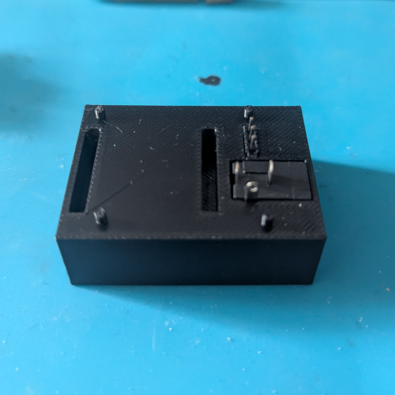
 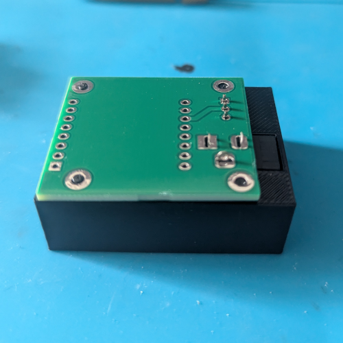
 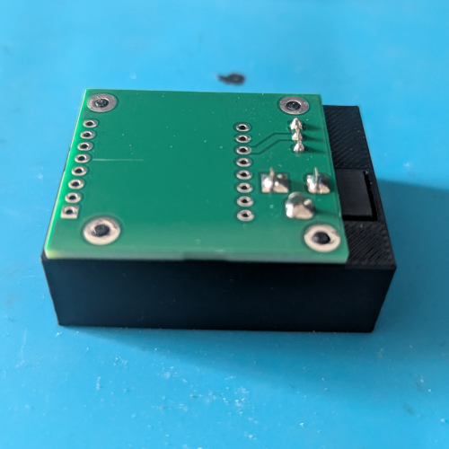

- Pin 2.54mm : [Aliexpress](https://s.click.aliexpress.com/e/_c4cRkKOH)
- Barrel Type DC Connector : [Aliexpress](https://s.click.aliexpress.com/e/_c32rjzPT)

<b> If you received the kit from me you can pass this step.</b>

Solder the pin 2.54mm and the barrel jack to the bare PCB shield, you can use the 3D print guide for better alignement

# Step 3

 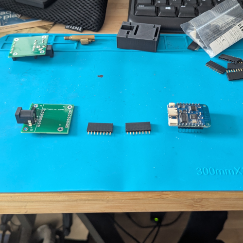
 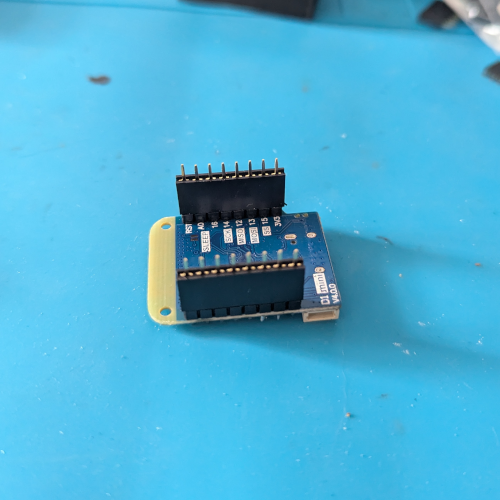
 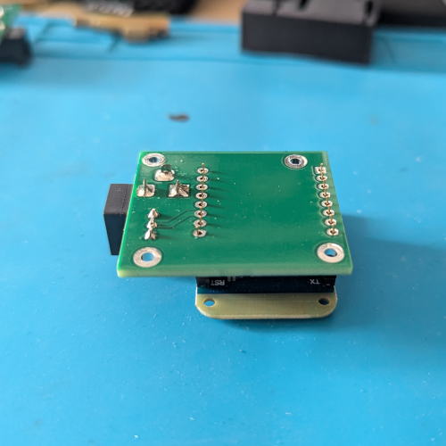

<b> If you received the kit from me you can pass this step.</b>

Solder the receptacle for the Wemos D1 to the shield, you can place the female pin on the wemos to correctly align them when soldering to the shield

# Step 4

 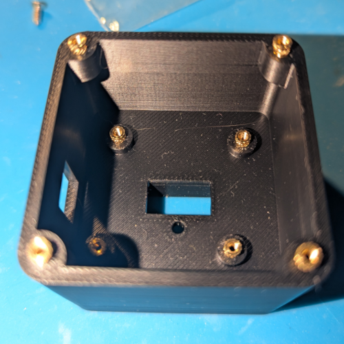
 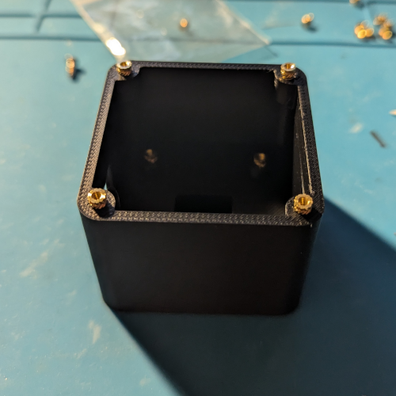

 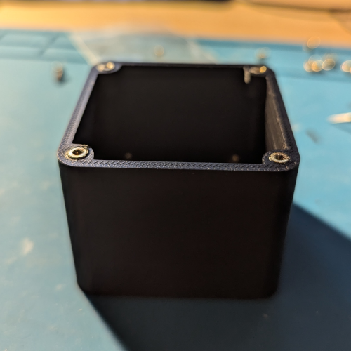
 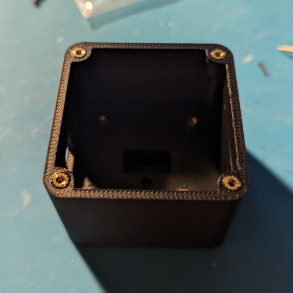

<b> If you received the kit from me you can pass this step.</b>

Place the insert on the 8 holes of the 3D printed part and push them using a soldering iron (Look for tutorial on internet)

# Step 5

 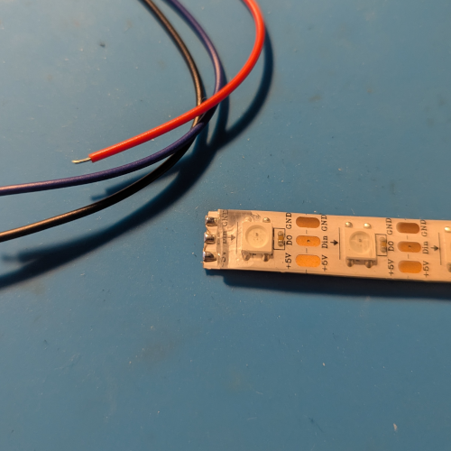
 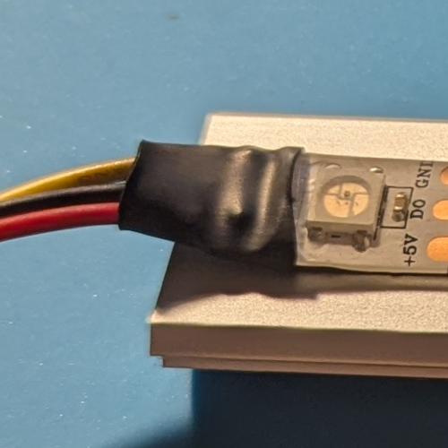

Solder the led connector on the led strip, you can add heat shrink tubing for additionnal protection

Make sure to solder the red cable on the + side etc

# Step 6

 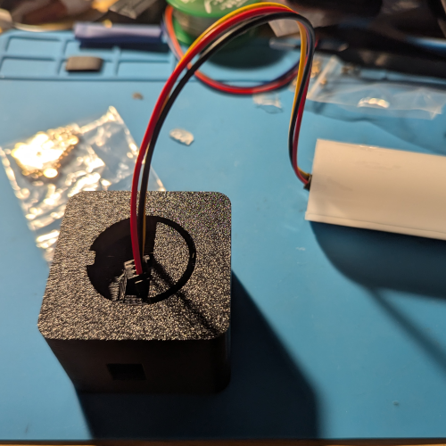
 
 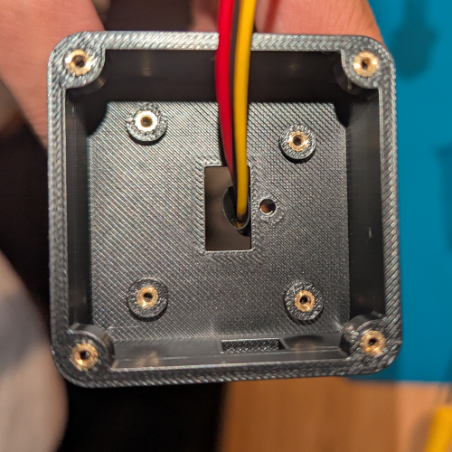
 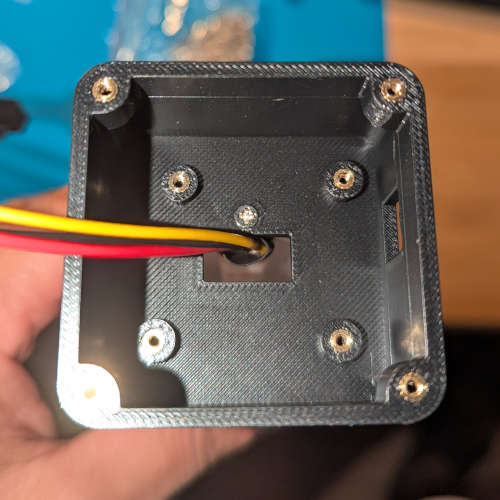

Pass the connector inside the hole on the 3D print part and push the aluminium bar inside while aligning the notch to the hole 

Then put the small screw next to the cable to attach the box and the bar together

# Step 7

 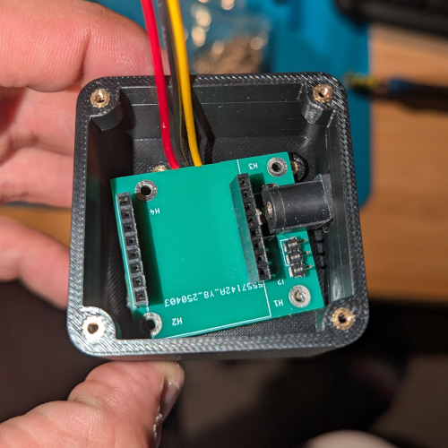
 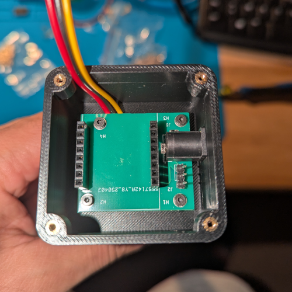

Place the pcb inside the enclosure, make sure to not tangle the cable from the led, the pcb will maintain the cable in place properly

Then you can put the four screw to fix the pcb in place

# Step 8

 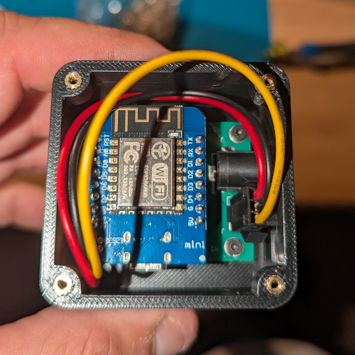

Place the wemos inside on the socket with the 5V pin on the side of the barrel jack

Then place the led connector on the 3 pin headers with the red cable (+ of the led) on the side of the barrel jack

# Step 9

 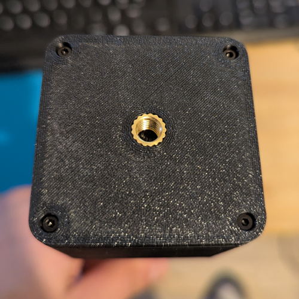

Close the lid for the box and place the four remaining screws

# Step 10

 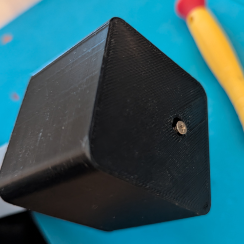

Place the bottom piece on the tip of the bar and screw in the screw

Then you are done ! Enjoy !!!